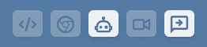
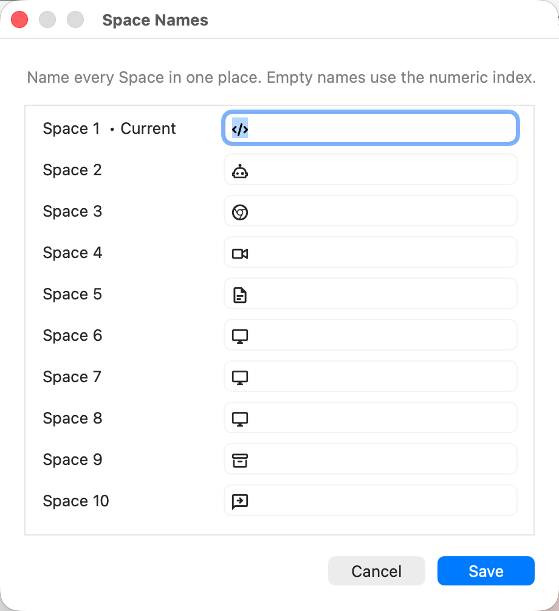

# SpaceId for yabai

This is my personal build of [SpaceId](https://github.com/dshnkao/SpaceId), adapted for managing Spaces with [yabai](https://github.com/asmvik/yabai).

Features:
- Shows every Space with an application window and hides inactive empty Spaces.
- Lets you name Spaces, with Nerd Font support.
- Left-click a Space label to switch directly to that Space.
- Scroll over the menu bar item to move between Spaces with windows, including Spaces on other displays.





If you do not use [yabai](https://github.com/asmvik/yabai), please download the original [SpaceId](https://github.com/dshnkao/SpaceId).

# Original SpaceId README


## Install

```shell
brew install --cask spaceid
```

Or download and install the [latest release](https://github.com/dshnkao/SpaceId/releases).

## Credits

* This project is inspired by [WhichSpace](https://github.com/gechr/WhichSpace/).
* Icon made by [Lucy G](http://bylucyg.com) from [FLATICON](http://www.flaticon.com) under [CC By 3.0](https://creativecommons.org/licenses/by/3.0/)
